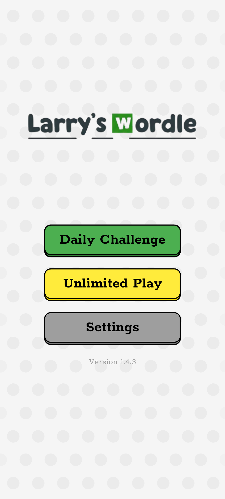
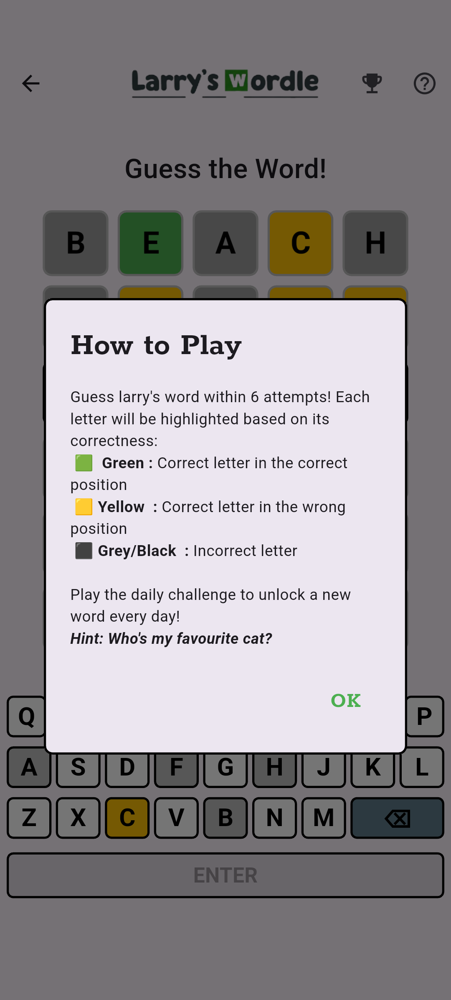
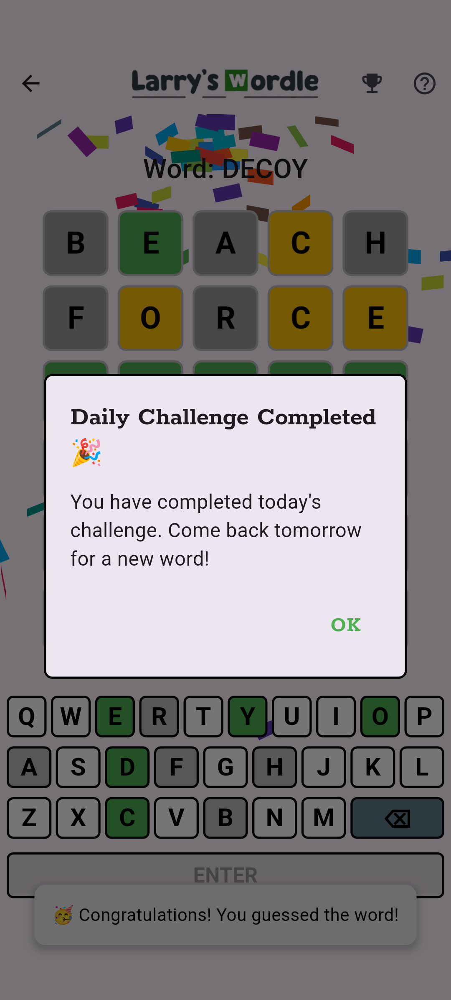
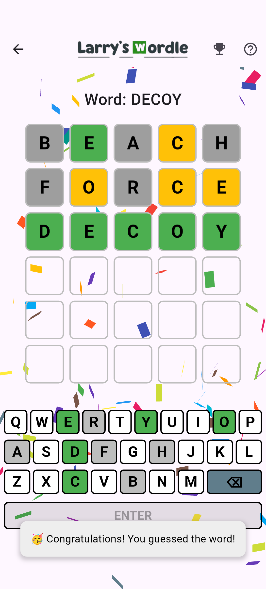
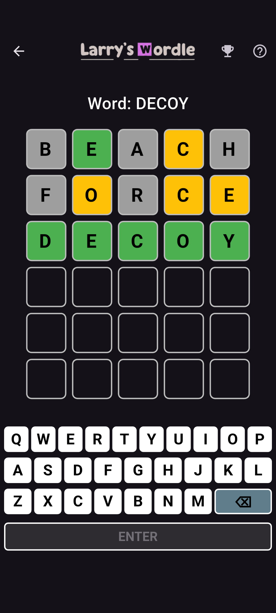
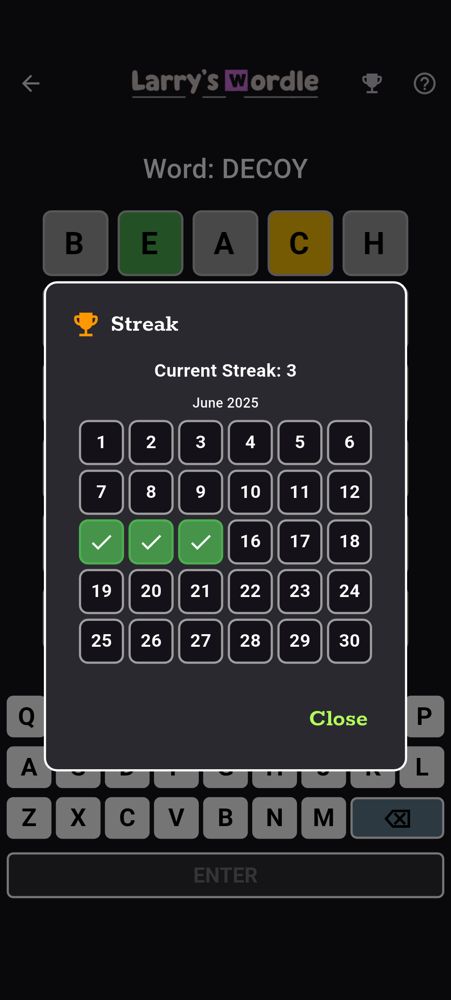
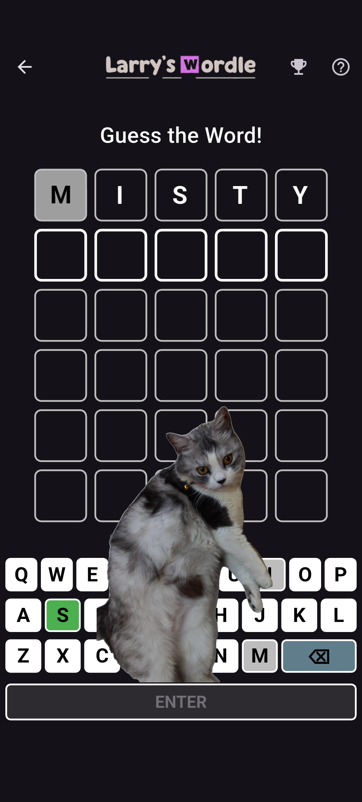

# Larry's Wordle

This is a project of mine built using flutter, riverpod, and AWS DynamoDB, Lambda, Gateway as backend.
The project is a clone of the popular game Wordle, where players guess a five-letter word within six attempts.
It features a user-friendly interface, real-time updates, and a scoring system that tracks the number of attempts taken to guess the word correctly!
## Features

- **Game Logic**: Players can guess a five-letter word, with feedback provided for each guess.
- **Real-time Updates**: The daily word is fetched from a Lambda function which is set to run daily using eventbridge, ensuring that all players are guessing the same word.
- **Scoring System**: Tracks the number of attempts taken to guess the word correctly.
- **Responsive Design**: The app is designed to work on both mobile and web platforms.
- **State Management**: Utilizes Riverpod for state management, ensuring a reactive and efficient UI.
- **Dark Mode**: The app supports dark mode for better user experience.

## Upcoming Features
- **User Authentication**: Sign up and log in using AWS Cognito. (to be implemented!)
- **Leaderboard**: A leaderboard to track the top players based on their scores.
- **Stripe Integration**: For in-app purchases or donations to support the game.

## Getting Started

To run this project locally, follow these steps:
1. Clone the repository:
   ```bash
   git clone https://github.com/AjaxxIsHere/Larry-s-Wordle-A-wordle-inspired-mobile-game
   cd Larry-s-Wordle-A-wordle-inspired-mobile-game
   ```

```bash
   flutter pub get
   ```

```bash
   flutter run
   ```
2. Set up your AWS credentials and configure the backend services (DynamoDB, Lambda, API Gateway).
3. Update the API endpoints in the app to point to your AWS services.
4. Run the app on your preferred platform (mobile or web).

## Screenshots










