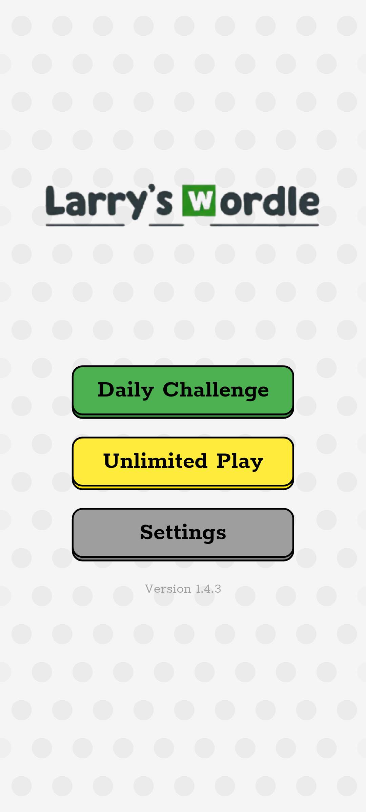
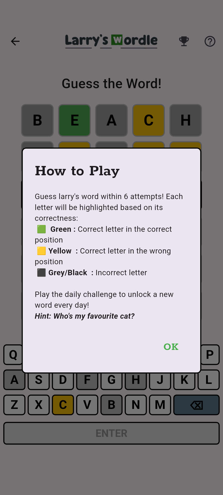
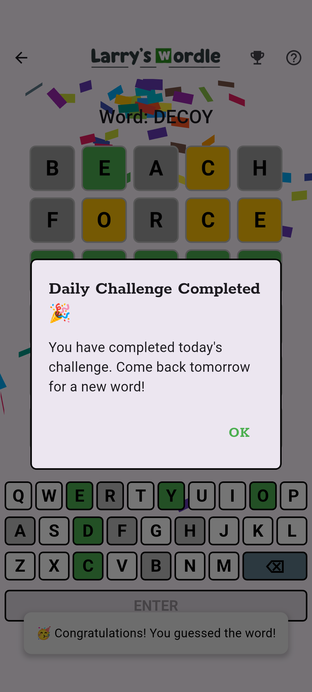
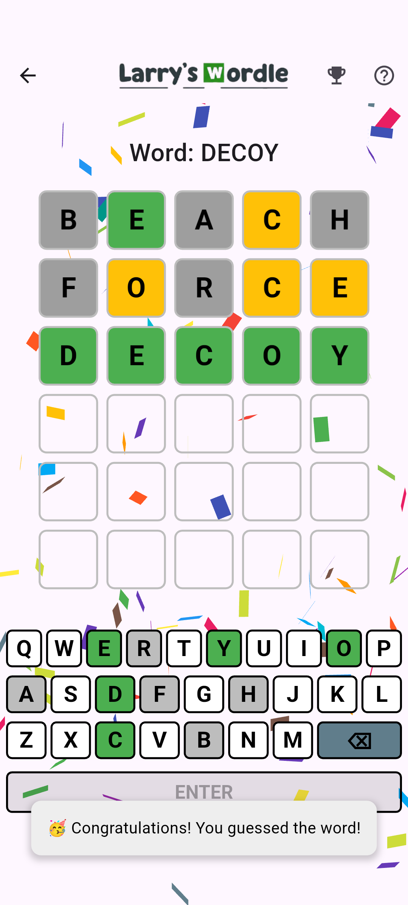
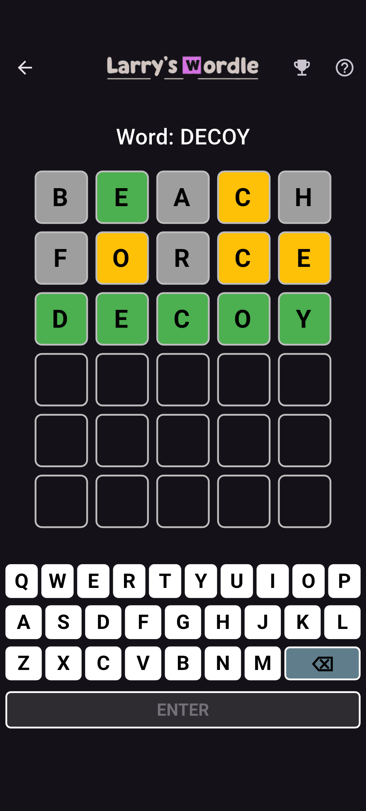
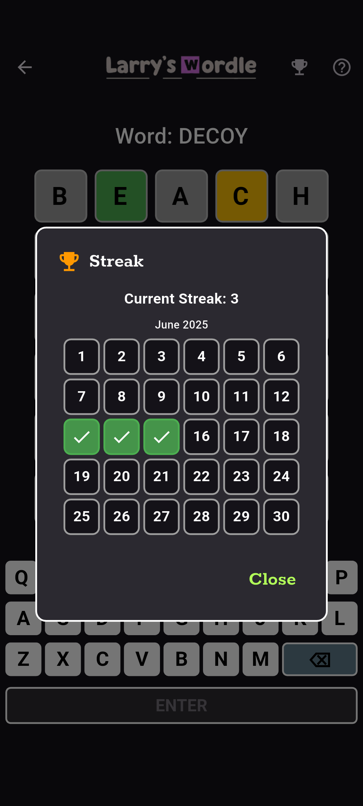
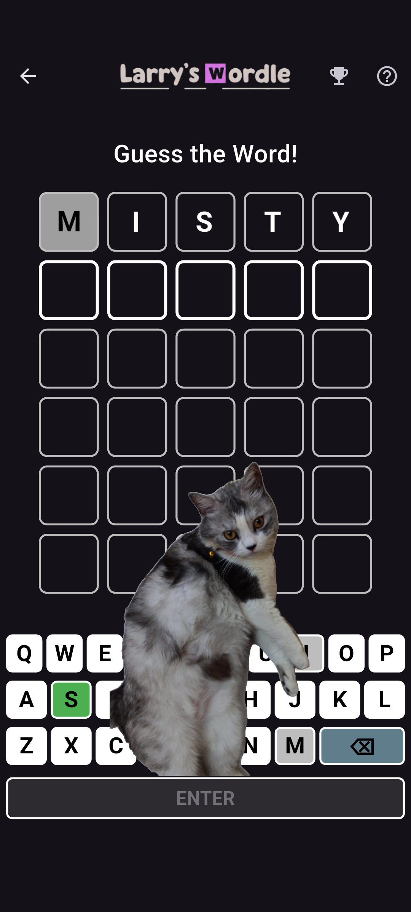

<div align="center">
  <h1>🐈 Larry's Wordle 🧩</h1>
  <p><b>A cross-platform daily word puzzle powered by Flutter and Serverless AWS</b></p>

  <a href="https://drive.google.com/uc?export=download&id=1dq8AhOxZu4l5by8WaAXgb9OZuVb4mSd_"></a>
</div>

<br>

## 📸 App Gallery

<div align="center">
  
  
  
  
  
  
  
</div>

<br>

## 🎮 The Game
**Larry's Wordle** brings the viral daily word-guessing challenge natively to mobile and web. Players get six attempts to guess the secret five-letter word, with color-coded feedback guiding them to the correct answer. 

Every single player worldwide gets the exact same word every day, fully synchronized by an automated cloud backend.

---

## 🏗️ System Architecture & Tech Stack

This project is built using a modern decoupled architecture, combining a reactive mobile frontend with a highly scalable serverless backend.

### 📱 Frontend (Flutter & Riverpod)
* **Cross-Platform:** Single codebase compiled for both Android and Web.
* **State Management:** Fully reactive UI powered by **Riverpod** to handle game logic, keyboard states, and scoring efficiently.
* **Adaptive Theme:** Beautiful UI with native **Dark Mode** support and fluid animations.
* **Local Notifications:** Daily reminders and challenge alerts pushed directly to your device.

### ☁️ Backend (AWS Serverless)
* **Automated Cron Jobs:** **Amazon EventBridge** triggers a daily cron job at midnight.
* **Serverless Compute:** **AWS Lambda** executes the logic to select the new daily word and update the active game state.
* **Database & Routing:** Data is stored in **DynamoDB** and served to the client securely via **API Gateway**.

---

## 🚀 Upcoming Features
We are constantly expanding the game. Next on the roadmap:
- 🔐 **AWS Cognito Auth:** User sign-up, login, and secure cloud-saving for your daily streak.
- 🏆 **Global Leaderboards:** Compare your average guess count and win streak against top players.
- 💳 **Stripe Integration:** In-app purchases and donation gateways.

---

## 🛠️ Local Setup & Installation

To run Larry's Wordle locally on your machine, ensure you have the Flutter SDK installed.

**1. Clone the repository**
```bash
git clone [https://github.com/AjaxxIsHere/Larry-s-Wordle-A-wordle-inspired-mobile-game.git](https://github.com/AjaxxIsHere/Larry-s-Wordle-A-wordle-inspired-mobile-game.git)
cd Larry-s-Wordle-A-wordle-inspired-mobile-game

```

**2. Install Flutter dependencies**

```bash
flutter pub get

```

**3. Configure your AWS Backend**

* Ensure your DynamoDB tables, Lambda functions, and API Gateway are deployed.
* Update the base API URL in the Flutter application to point to your deployed AWS Gateway endpoint.

**4. Run the application**

```bash
flutter run

```
